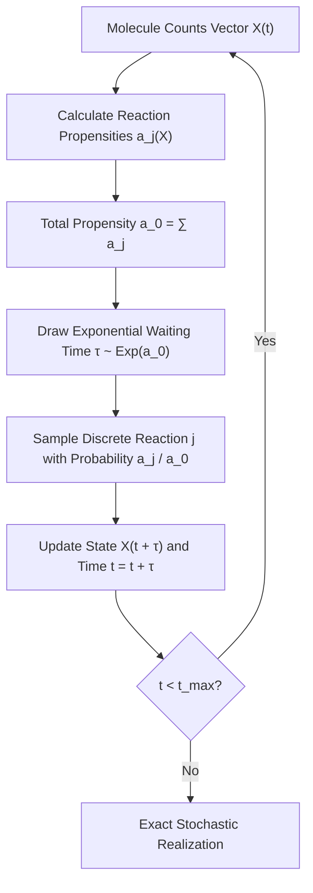

# Gillespie Stochastic Simulation Algorithm (SSA) Skill

Exact stochastic event simulation for chemical reaction networks and master equations.

## Features
- **100% Python Standard Library**: Inversion sampling of exponential waiting intervals.
- **Exact Master Equation Realization**: Captures genuine discrete stochastic noise in low-copy molecular systems.
